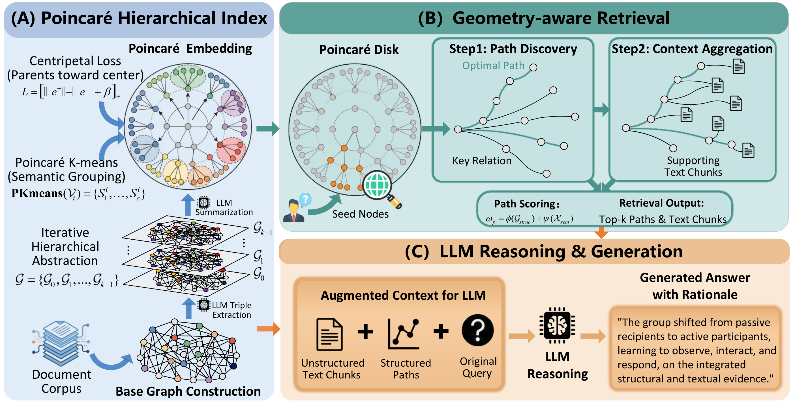

# PoincaréRAG

PoincaréRAG: Modeling Hierarchical Query Intents for Retrieval-Augmented Generation  
Submitted to IEEE TKDE (IEEE Transactions on Knowledge and Data Engineering)
## Overview of PoincaréRAG


## Features

- Hyperbolic embedding pipeline with hierarchical retrieval
- OpenAI / GLM / DeepSeek integration paths
- Local graph and vector stores via working directories
- Evaluation scripts and sample result artifacts

## Requirements

- Python >= 3.9
- Dependencies listed in requirements.txt

## Installation

From the PoincaréRAG directory:

```bash
pip install -r requirements.txt
```

## Configuration

Edit config.yaml and fill in credentials and model settings:

- openai / glm / deepseek: api_key, base_url, model, embedding_model
- model_params: embedding dimensions and max token size
- hirag: enable_llm_cache, enable_hierachical_mode, and related flags

Add a working directory for local storage:

```yaml
poincarérag:
  working_dir: "./working_dir"
```

## Quick Start

Run from the PoincaréRAG directory:

```bash
python poincare_search_openai.py
```

This script loads config.yaml and runs indexing + querying in sample_insert. Adjust:

- Text file path (example: working_dir2/book.txt)
- Dataset and working directory values in sample_insert

GLM and DeepSeek examples:

```bash
python poincare_search_glm.py
python poincare_search_deepseek.py
```

Replace the placeholder text file path before running.

## Evaluation and Data Utilities

Evaluation entry point (example):

```bash
python eval/test_openai.py -d mix -m hi
```

Data utilities:

- eval/extract_query.py: extract queries from a dataset
- eval/extract_context.py: extract unique contexts

## Directory Structure

- hirag/: core algorithms and retrieval implementation
- eval/: evaluation scripts and datasets
- MLP/: hyperbolic mapping scripts and model artifacts
- working_dir/: local index and cache files
- config.yaml: model and API configuration

## License

MIT License
